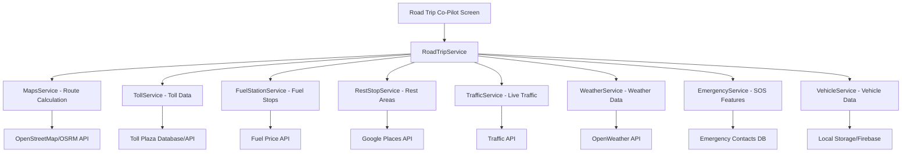

# Road Trip Co-Pilot - Comprehensive Feature Plan

## Executive Summary

The Road Trip Co-Pilot feature will transform TravelBuddyAI into a complete road journey companion for car travelers. This plan outlines a comprehensive set of features specifically designed for users traveling by their own vehicle (preferably car) on Indian roads.

---

## 1. Current State Analysis

### ✅ Already Implemented
- **Basic toll calculation** - [`BudgetService.calculateTollCharges()`](lib/services/budget_service.dart:30)
- **Fuel cost estimation** - [`BudgetService.calculateFuelCost()`](lib/services/budget_service.dart:14)
- **Distance calculation** - [`MapsService.getDistanceKm()`](lib/services/maps_service.dart:16)
- **Rest stop model** - [`RestStop`](lib/models/rest_stop_model.dart:10) with types (petrol, restaurant, restroom, parking, medical, hospital)
- **Location-based fuel pricing** - [`PricingService.getFuelPrice()`](lib/services/pricing_service.dart:115)
- **State-specific fuel prices** - [`PricingService._getStateFuelPrices()`](lib/services/pricing_service.dart:233)
- **Route-based toll rates** - [`PricingService.getTollRatePerKm()`](lib/services/pricing_service.dart:197)

### ❌ Missing Features
- Real-time toll plaza locations and exact charges
- Fuel station finder along route with live prices
- Route optimization for fuel efficiency
- Real-time traffic updates
- Weather conditions along route
- Emergency services locator
- Vehicle maintenance reminders
- Parking availability at destinations
- Highway amenities (food courts, rest areas)
- Alternative route suggestions
- Night driving safety alerts
- Speed limit warnings
- Road condition updates

---

## 2. Comprehensive Feature Set Design

### 🎯 Core Features (Priority 1 - MVP)

#### 2.1 Smart Route Planning
**Description**: Intelligent route planning optimized for car travel

**Features**:
- **Route Optimization**
  - Shortest vs fastest route options
  - Fuel-efficient route calculation
  - Avoid toll roads option
  - Scenic route suggestions
  
- **Multi-Stop Planning**
  - Add waypoints along the route
  - Optimize stop sequence
  - Estimated time at each stop
  - Total journey time calculation

- **Route Alternatives**
  - Show 2-3 alternative routes
  - Compare distance, time, tolls, fuel cost
  - Highlight pros/cons of each route

**Data Model**:
```dart
class RouteDetails {
  final String routeId;
  final String origin;
  final String destination;
  final List<Waypoint> waypoints;
  final double totalDistanceKm;
  final Duration estimatedDuration;
  final double estimatedFuelCost;
  final double estimatedTollCost;
  final List<TollPlaza> tollPlazas;
  final RouteType type; // fastest, shortest, scenic, fuel_efficient
  final List<LatLng> polylinePoints;
}

class Waypoint {
  final String name;
  final LatLng location;
  final Duration stopDuration;
  final WaypointType type; // fuel, food, rest, attraction
}
```

#### 2.2 Live Toll Information
**Description**: Real-time toll plaza information with exact charges

**Features**:
- **Toll Plaza Locator**
  - Show all toll plazas on route
  - Distance to next toll plaza
  - Toll plaza name and location
  - Operating hours
  
- **Exact Toll Charges**
  - Vehicle type-based pricing (car, SUV, commercial)
  - FASTag vs cash pricing
  - Total toll cost for journey
  - Toll-free alternative routes

- **Payment Options**
  - FASTag balance check integration
  - Cash requirement calculation
  - Digital payment options at plaza

**Data Model**:
```dart
class TollPlaza {
  final String id;
  final String name;
  final LatLng location;
  final double distanceFromOriginKm;
  final Map<VehicleType, double> charges; // car, suv, lcv, etc.
  final bool hasFastag;
  final String operatingHours;
  final List<String> paymentMethods;
  final String highway; // NH-44, NH-16, etc.
}

enum VehicleType { car, suv, lcv, hcv, bus }
```

#### 2.3 Fuel Station Finder
**Description**: Find fuel stations along route with live pricing

**Features**:
- **Station Locator**
  - Fuel stations within 5km of route
  - Distance to next station
  - Brand (IOCL, BPCL, HP, Shell, etc.)
  - Amenities (restroom, food, ATM)
  
- **Live Fuel Prices**
  - Current petrol/diesel prices
  - Price comparison between stations
  - Historical price trends
  - Best price alerts

- **Fuel Planning**
  - Optimal refueling points
  - Fuel range calculator
  - Low fuel warnings
  - Cost-effective refueling strategy

**Data Model**:
```dart
class FuelStation {
  final String id;
  final String name;
  final String brand; // IOCL, BPCL, HP, Shell
  final LatLng location;
  final double distanceFromRouteKm;
  final double distanceFromCurrentKm;
  final FuelPrices prices;
  final List<String> amenities;
  final double rating;
  final bool isOpen24x7;
  final String contactNumber;
}

class FuelPrices {
  final double petrol;
  final double diesel;
  final DateTime lastUpdated;
  final String source;
}
```

#### 2.4 Rest Stop Recommendations
**Description**: Strategic rest stops for safe and comfortable journey

**Features**:
- **Smart Stop Planning**
  - Suggest stops every 2-3 hours
  - Family-friendly locations
  - Clean restroom facilities
  - Food options (restaurants, dhabas)
  
- **Amenity Finder**
  - Restaurants with ratings
  - Clean restrooms
  - Parking availability
  - Kids play areas
  - Medical facilities

- **Safety Stops**
  - Well-lit areas for night travel
  - Populated areas
  - Police stations nearby
  - Emergency services

**Enhanced Data Model**:
```dart
class RestStop {
  // Existing fields from rest_stop_model.dart
  final String id;
  final String name;
  final String address;
  final RestStopType type;
  final double distanceKm;
  final LatLng location;
  final bool isOpen;
  final String rating;
  final List<String> facilities;
  
  // New fields
  final bool isFamilyFriendly;
  final bool hasParking;
  final bool isWellLit;
  final String openingHours;
  final double avgStopDuration; // in minutes
  final List<String> reviews;
  final String priceRange; // budget, mid, premium
}
```

### 🚀 Advanced Features (Priority 2)

#### 2.5 Real-Time Traffic & Weather
**Description**: Live traffic and weather updates for informed decisions

**Features**:
- **Traffic Updates**
  - Real-time traffic conditions
  - Accident alerts
  - Road closures
  - Construction zones
  - Estimated delay times
  
- **Weather Monitoring**
  - Current weather along route
  - Weather forecast for journey
  - Rain/fog/storm alerts
  - Visibility conditions
  - Temperature updates

- **Smart Rerouting**
  - Automatic reroute on heavy traffic
  - Weather-based route changes
  - ETA updates based on conditions

**Data Model**:
```dart
class TrafficCondition {
  final String segmentId;
  final LatLng startPoint;
  final LatLng endPoint;
  final TrafficLevel level; // free, moderate, heavy, blocked
  final String reason; // accident, construction, weather
  final Duration estimatedDelay;
  final DateTime lastUpdated;
}

class WeatherCondition {
  final LatLng location;
  final String locationName;
  final double temperatureCelsius;
  final String condition; // sunny, rainy, foggy, stormy
  final double visibilityKm;
  final double windSpeedKmh;
  final int rainChancePercent;
  final DateTime timestamp;
}
```

#### 2.6 Emergency Services
**Description**: Quick access to emergency services along route

**Features**:
- **Emergency Contacts**
  - Nearest hospitals
  - Police stations
  - Ambulance services
  - Breakdown services
  - Insurance helplines
  
- **SOS Button**
  - One-tap emergency call
  - Share live location
  - Alert emergency contacts
  - Nearest help location

- **Medical Facilities**
  - Hospitals with specialties
  - 24x7 pharmacies
  - Blood banks
  - Trauma centers

**Data Model**:
```dart
class EmergencyService {
  final String id;
  final EmergencyType type;
  final String name;
  final LatLng location;
  final double distanceKm;
  final String phoneNumber;
  final bool is24x7;
  final List<String> services;
  final String address;
}

enum EmergencyType {
  hospital,
  police,
  ambulance,
  fireStation,
  mechanicShop,
  towingService
}
```

#### 2.7 Vehicle Maintenance Tracker
**Description**: Track vehicle health and maintenance needs

**Features**:
- **Maintenance Reminders**
  - Oil change due
  - Tire rotation needed
  - Service schedule
  - Insurance renewal
  - Pollution certificate
  
- **Trip-Based Tracking**
  - Odometer reading
  - Fuel efficiency tracking
  - Cost per kilometer
  - Maintenance history

- **Pre-Trip Checklist**
  - Tire pressure check
  - Fluid levels
  - Lights and indicators
  - Emergency kit
  - Documents verification

**Data Model**:
```dart
class VehicleProfile {
  final String vehicleId;
  final String make;
  final String model;
  final int year;
  final VehicleType type;
  final double currentOdometerKm;
  final double fuelTankCapacityLiters;
  final double averageMileageKmpl;
  final DateTime lastServiceDate;
  final DateTime nextServiceDue;
  final DateTime insuranceExpiry;
  final DateTime pucExpiry;
}

class MaintenanceReminder {
  final String id;
  final String vehicleId;
  final MaintenanceType type;
  final DateTime dueDate;
  final int dueAtOdometerKm;
  final bool isOverdue;
  final String description;
}
```

### 💎 Premium Features (Priority 3)

#### 2.8 Parking Assistance
**Description**: Find and book parking at destinations

**Features**:
- **Parking Finder**
  - Available parking spots
  - Pricing information
  - Distance from destination
  - Security features
  
- **Advance Booking**
  - Reserve parking spot
  - Payment integration
  - QR code entry
  - Time-based pricing

#### 2.9 Highway Amenities Guide
**Description**: Complete guide to highway facilities

**Features**:
- **Food Courts & Restaurants**
  - Highway dhabas
  - Food courts
  - Fast food chains
  - Local cuisine options
  
- **Rest Areas**
  - Government rest houses
  - Private lounges
  - Sleeping pods
  - Shower facilities

#### 2.10 Night Driving Assistant
**Description**: Enhanced safety for night journeys

**Features**:
- **Safety Alerts**
  - Fatigue detection reminders
  - Well-lit route suggestions
  - Populated area stops
  - Wildlife crossing zones
  
- **Accommodation Finder**
  - Budget hotels along route
  - Last-minute booking
  - Safe parking facilities
  - 24x7 check-in options

---

## 3. Service Architecture

### 3.1 New Services Required

```dart
// lib/services/road_trip_service.dart
class RoadTripService {
  Future<RouteDetails> planRoute(String origin, String destination, RoutePreferences prefs);
  Future<List<RouteDetails>> getAlternativeRoutes(String origin, String destination);
  Future<List<TollPlaza>> getTollPlazasOnRoute(RouteDetails route);
  Future<List<FuelStation>> getFuelStationsOnRoute(RouteDetails route, double maxDistanceKm);
  Future<List<RestStop>> getRestStopsOnRoute(RouteDetails route);
  Future<double> calculateTotalTripCost(RouteDetails route, VehicleProfile vehicle);
}

// lib/services/toll_service.dart
class TollService {
  Future<List<TollPlaza>> getTollPlazasByHighway(String highway);
  Future<double> calculateTollCost(List<TollPlaza> plazas, VehicleType vehicleType);
  Future<TollPlaza?> getNearestTollPlaza(LatLng location);
  Future<List<String>> getAlternativeTollFreeRoutes(String origin, String destination);
}

// lib/services/fuel_station_service.dart
class FuelStationService {
  Future<List<FuelStation>> findNearbyStations(LatLng location, double radiusKm);
  Future<FuelPrices> getLiveFuelPrices(String city);
  Future<FuelStation> findCheapestStation(List<FuelStation> stations);
  Future<List<FuelStation>> planRefuelingStops(RouteDetails route, VehicleProfile vehicle);
}

// lib/services/traffic_service.dart
class TrafficService {
  Future<List<TrafficCondition>> getTrafficOnRoute(RouteDetails route);
  Future<RouteDetails> getReroutedPath(RouteDetails original, TrafficCondition incident);
  Stream<TrafficCondition> subscribeToTrafficUpdates(RouteDetails route);
}

// lib/services/weather_service.dart (enhance existing OpenWeatherService)
class WeatherService {
  Future<List<WeatherCondition>> getWeatherAlongRoute(RouteDetails route);
  Future<WeatherCondition> getWeatherAtLocation(LatLng location);
  Future<List<WeatherAlert>> getWeatherAlerts(RouteDetails route);
}

// lib/services/emergency_service.dart
class EmergencyService {
  Future<List<EmergencyService>> findNearbyServices(LatLng location, EmergencyType type);
  Future<void> triggerSOS(LatLng location, String userId);
  Future<List<String>> getEmergencyContacts(String state);
}

// lib/services/vehicle_service.dart
class VehicleService {
  Future<VehicleProfile> getVehicleProfile(String vehicleId);
  Future<List<MaintenanceReminder>> getUpcomingReminders(String vehicleId);
  Future<void> updateOdometer(String vehicleId, double newReading);
  Future<double> calculateFuelEfficiency(String vehicleId, List<Trip> recentTrips);
}
```

### 3.2 Service Integration Points



---

## 4. UI/UX Design

### 4.1 Main Road Trip Co-Pilot Screen

**Layout**:
```
┌─────────────────────────────────────┐
│  🚗 Road Trip Co-Pilot              │
├─────────────────────────────────────┤
│                                     │
│  📍 From: [Origin Input]            │
│  📍 To:   [Destination Input]       │
│                                     │
│  🚙 Vehicle: [Select Vehicle]       │
│  ⚙️  Route Type: [Fastest/Shortest] │
│                                     │
│  ┌─────────────────────────────┐   │
│  │  🗺️  Plan My Route          │   │
│  └─────────────────────────────┘   │
│                                     │
│  Quick Actions:                     │
│  ┌──────┐ ┌──────┐ ┌──────┐       │
│  │ ⛽ Fuel│ │ 🛣️ Toll│ │ 🍽️ Food│   │
│  └──────┘ └──────┘ └──────┘       │
│                                     │
│  Recent Trips:                      │
│  • Mumbai → Pune (2 days ago)       │
│  • Delhi → Jaipur (1 week ago)      │
│                                     │
└─────────────────────────────────────┘
```

### 4.2 Route Details Screen

**Layout**:
```
┌─────────────────────────────────────┐
│  ← Mumbai → Pune                    │
├─────────────────────────────────────┤
│  🗺️ [Interactive Map with Route]    │
│                                     │
│  📊 Trip Summary                    │
│  • Distance: 148 km                 │
│  • Duration: 3h 15min               │
│  • Fuel Cost: ₹890                  │
│  • Toll Cost: ₹420                  │
│  • Total: ₹1,310                    │
│                                     │
│  🛣️  Toll Plazas (3)                │
│  ├─ Khalapur Toll - ₹140 (45km)    │
│  ├─ Lonavala Toll - ₹140 (78km)    │
│  └─ Talegaon Toll - ₹140 (112km)   │
│                                     │
│  ⛽ Fuel Stops (Recommended)        │
│  ├─ HP Petrol Pump - ₹106.5/L      │
│  │   📍 Panvel (22km)               │
│  └─ IOCL Station - ₹105.8/L         │
│      📍 Lonavala (85km)             │
│                                     │
│  🍽️  Rest Stops (2)                 │
│  ├─ McDonald's Lonavala             │
│  │   ⭐ 4.2 • 🚻 Clean • 🅿️ Parking │
│  └─ Café Coffee Day Talegaon        │
│      ⭐ 4.0 • 🚻 Clean • 🅿️ Parking │
│                                     │
│  ┌─────────────────────────────┐   │
│  │  🚀 Start Navigation         │   │
│  └─────────────────────────────┘   │
│                                     │
└─────────────────────────────────────┘
```

### 4.3 Live Journey Screen

**Layout**:
```
┌─────────────────────────────────────┐
│  🗺️ [Full Screen Map]               │
│                                     │
│  ┌─────────────────────────────┐   │
│  │ Next: Khalapur Toll          │   │
│  │ 12 km • 15 min               │   │
│  │ ₹140 (FASTag)                │   │
│  └─────────────────────────────┘   │
│                                     │
│  ⛽ Fuel: 45% (180km range)         │
│  🚦 Traffic: Moderate               │
│  🌤️  Weather: Clear, 28°C           │
│                                     │
│  [🆘 SOS]  [⛽ Fuel]  [🍽️ Food]     │
│                                     │
└─────────────────────────────────────┘
```

---

## 5. API Integrations

### 5.1 Required APIs

| API | Purpose | Cost | Priority |
|-----|---------|------|----------|
| **OpenStreetMap/OSRM** | Route calculation | Free | ✅ Already integrated |
| **Google Maps Directions API** | Alternative routing | Paid | P1 |
| **TollGuru API** | Toll plaza data | Paid | P1 |
| **Indian Oil Fuel Price API** | Live fuel prices | Free/Paid | P1 |
| **Google Places API** | Fuel stations, restaurants | Paid | P1 |
| **OpenWeather API** | Weather data | Free tier | ✅ Already integrated |
| **TomTom Traffic API** | Real-time traffic | Paid | P2 |
| **HERE Maps API** | Alternative to Google | Paid | P2 |
| **FASTag API** | Balance check | Requires partnership | P3 |

### 5.2 Fallback Strategies

- **Toll Data**: Maintain local database of major toll plazas with manual updates
- **Fuel Prices**: Use state-wise average prices (already implemented in [`PricingService`](lib/services/pricing_service.dart:233))
- **Traffic**: Use historical data patterns if live API unavailable
- **Weather**: Cache last known conditions, show warnings for outdated data

---

## 6. Implementation Roadmap

### Phase 1: MVP (2-3 weeks)
**Goal**: Basic road trip planning with toll and fuel information

- [ ] Create [`RouteDetails`](lib/models/route_model.dart) and [`TollPlaza`](lib/models/toll_plaza_model.dart) models
- [ ] Implement [`RoadTripService`](lib/services/road_trip_service.dart) with basic route planning
- [ ] Enhance [`TollService`](lib/services/toll_service.dart) with toll plaza database
- [ ] Create [`FuelStationService`](lib/services/fuel_station_service.dart) using Google Places API
- [ ] Build main Road Trip Co-Pilot screen UI
- [ ] Implement route details screen with toll and fuel information
- [ ] Add vehicle profile selection
- [ ] Integrate with existing [`BudgetService`](lib/services/budget_service.dart:81) for cost calculation

**Deliverables**:
- Users can plan a road trip with origin/destination
- View toll plazas on route with estimated costs
- Find fuel stations along route
- See total trip cost breakdown

### Phase 2: Enhanced Features (2-3 weeks)
**Goal**: Add rest stops, weather, and emergency services

- [ ] Enhance [`RestStop`](lib/models/rest_stop_model.dart:10) model with new fields
- [ ] Implement rest stop recommendations along route
- [ ] Integrate weather data for route (enhance existing [`OpenWeatherService`](lib/services/openweather_service.dart))
- [ ] Create [`EmergencyService`](lib/services/emergency_service.dart) with SOS functionality
- [ ] Add alternative route comparison
- [ ] Implement route optimization options (fastest/shortest/fuel-efficient)
- [ ] Build live journey tracking screen
- [ ] Add traffic condition display (if API available)

**Deliverables**:
- Smart rest stop suggestions every 2-3 hours
- Weather forecast along route
- Emergency services locator
- Alternative route options
- Live journey tracking

### Phase 3: Advanced Features (3-4 weeks)
**Goal**: Vehicle tracking, maintenance, and premium features

- [ ] Create [`VehicleProfile`](lib/models/vehicle_profile_model.dart) and [`MaintenanceReminder`](lib/models/maintenance_reminder_model.dart) models
- [ ] Implement [`VehicleService`](lib/services/vehicle_service.dart) for vehicle management
- [ ] Add vehicle maintenance tracker
- [ ] Implement pre-trip checklist
- [ ] Add parking finder integration
- [ ] Create night driving assistant features
- [ ] Implement trip history and analytics
- [ ] Add fuel efficiency tracking
- [ ] Build highway amenities guide

**Deliverables**:
- Complete vehicle management system
- Maintenance reminders
- Parking assistance
- Night driving safety features
- Trip analytics and history

### Phase 4: Polish & Optimization (1-2 weeks)
**Goal**: Performance optimization and user experience improvements

- [ ] Optimize API calls and caching
- [ ] Add offline mode for saved routes
- [ ] Implement route sharing functionality
- [ ] Add voice navigation integration
- [ ] Performance testing and optimization
- [ ] User feedback collection and iteration
- [ ] Documentation updates
- [ ] App store screenshots and marketing materials

---

## 7. Technical Considerations

### 7.1 Performance Optimization

- **Caching Strategy**:
  - Cache toll plaza data (update weekly)
  - Cache fuel prices (update daily)
  - Cache route polylines for recent searches
  - Use [`SharedPreferences`](lib/services/train_data_service.dart:25) for local storage

- **API Rate Limiting**:
  - Implement request throttling
  - Use batch requests where possible
  - Fallback to cached data on API failures

- **Map Performance**:
  - Lazy load map markers
  - Cluster nearby points
  - Simplify polylines for long routes

### 7.2 Data Storage

```dart
// Local Storage Keys
const String CACHED_ROUTES = 'cached_routes';
const String CACHED_TOLL_DATA = 'cached_toll_data';
const String CACHED_FUEL_PRICES = 'cached_fuel_prices';
const String VEHICLE_PROFILES = 'vehicle_profiles';
const String TRIP_HISTORY = 'trip_history';

// Firebase Collections (if using Firestore)
- /toll_plazas/{plazaId}
- /fuel_stations/{stationId}
- /rest_stops/{stopId}
- /user_vehicles/{userId}/{vehicleId}
- /trip_history/{userId}/{tripId}
```

### 7.3 Error Handling

- Graceful degradation when APIs fail
- Clear error messages to users
- Offline mode with cached data
- Retry mechanisms for failed requests
- Logging for debugging

---

## 8. Success Metrics

### 8.1 User Engagement
- Number of road trips planned per month
- Route details screen views
- Feature usage (toll finder, fuel finder, rest stops)
- Trip completion rate

### 8.2 User Satisfaction
- User ratings and reviews
- Feature-specific feedback
- Cost accuracy (actual vs estimated)
- Time accuracy (actual vs estimated)

### 8.3 Technical Metrics
- API response times
- App crash rate
- Cache hit rate
- Offline functionality usage

---

## 9. Future Enhancements

### 9.1 AI-Powered Features
- Personalized route recommendations based on history
- Predictive maintenance alerts using ML
- Smart fuel stop suggestions based on prices and range
- Traffic prediction using historical patterns

### 9.2 Social Features
- Share routes with friends
- Community-reported road conditions
- User reviews for rest stops
- Group trip planning

### 9.3 Integration Opportunities
- Car rental integration
- Insurance claim assistance
- Roadside assistance booking
- Hotel booking along route

---

## 10. Conclusion

The Road Trip Co-Pilot feature will position TravelBuddyAI as the go-to app for car travelers in India. By focusing on practical features like toll information, fuel planning, and rest stop recommendations, we address real pain points faced by road travelers.

The phased implementation approach ensures we can deliver value quickly while building towards a comprehensive solution. The architecture is designed to be extensible, allowing us to add more features based on user feedback and market demands.

**Next Steps**:
1. Review and approve this plan
2. Prioritize features based on user research
3. Begin Phase 1 implementation
4. Set up API accounts and test integrations
5. Create detailed UI mockups
6. Start development sprint

---

**Document Version**: 1.0  
**Last Updated**: 2026-06-16  
**Author**: Bob (Plan Mode)  
**Status**: Ready for Review